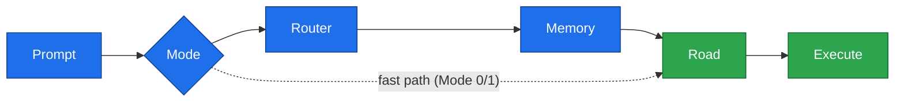

# AKRS v1 — Adaptive Knowledge Routing System

> Deliver the smallest correct knowledge, to the correct agent, at the correct moment.

---

## What is AKRS?

AKRS is a **framework for building AI execution workflows**.

It's not a memory system. It's not a documentation tool. It's not a planning framework.

AKRS is a **knowledge-routing architecture** that solves one problem:

> How do you let inexpensive execution models (like Gemini Flash) execute reliably on large, complex projects?

**Answer:** Reduce the decision space before execution begins.

---

## The Problem It Solves

Large projects create three challenges for AI agents:

- **Too much context** — Agent must scan thousands of files
- **Too many possible files** — Agent doesn't know what to read
- **Too many possible solutions** — Agent has no clear execution path

Large, expensive models survive this through brute force. Small models fail.

AKRS doesn't make agents smarter. **It makes decision spaces smaller.**

---

## The London Story

Imagine you're visiting London and need to find your friend's house.

**Bad approach:** Pick a random person on the street and ask them to guide you.  
*Result: Confusion, wrong turns, wasted time.*

**Good approach:**
1. Ask about the **city** (neighborhoods, districts)
2. Learn about the **neighborhood** (streets, landmarks)
3. Get specific **directions** to the house

The more specific your questions are, the more accurate the guidance.

**AKRS works the same way:**
- **Router** knows the city (which Plan?)
- **Memory** knows the neighborhood (which Knowledge?)
- **Road** knows the street (which files?)
- **Worker** executes with perfect clarity

---

## How It Works

Every execution follows **one path** — each step narrows the decision space
before the AI reasons:



> Full diagrams (modes, lifecycle, close-out) are in
> [`docs/guides/ROUTING-FLOW.md`](docs/guides/ROUTING-FLOW.md).

Each layer answers exactly one question:

| Layer | Answers |
|-------|---------|
| **Router** | Where should execution go? |
| **Memory** | Which knowledge do I need? |
| **Road** | Exactly what should I read? |
| **Task** | Exactly what should I build? |

Nothing is duplicated. Nothing is guessed. Everything is prepared.

---

## Core Principles

- Knowledge has **exactly one owner**. Everything else references it.
- Knowledge is **never duplicated** across files.
- Knowledge is **only loaded when required**.
- Every file answers **one purpose**. If it solves two, split it.
- **Planning and execution** are different jobs. They never share the same path.

---

## Installation

Install AKRS v1 framework:

```bash
npm install akrs-framework
# or
pnpm add akrs-framework
# or
yarn add akrs-framework
```

---

## Quick Start (2 Minutes)

1. Read `GETTING_STARTED.md` in this repository
2. Follow the step-by-step guide
3. Generate your first workflow with an AI model
4. Start your first task

---

## Documentation

| Document | Purpose |
|----------|---------|
| [GETTING_STARTED.md](GETTING_STARTED.md) | Complete beginner guide (step-by-step) |
| [docs/guides/ROUTING-FLOW.md](docs/guides/ROUTING-FLOW.md) | Visual explanation of the execution path |
| [docs/guides/FILE-STRUCTURE.md](docs/guides/FILE-STRUCTURE.md) | Folder organization and file ownership |
| [docs/framework/](docs/framework/) | Complete framework specifications |
| [examples/](examples/) | Real project examples |
| [docs/validation/](docs/validation/) | Test results and case studies |

---

## Examples

The most complete worked example today is the **Atlas ERP case study** — a full
Phase A → Phase B → execute → close-out cycle:
[`docs/validation/case-study-atlas-erp.md`](docs/validation/case-study-atlas-erp.md).

More sample projects (basic, existing-project integration, v0→v1 migration, full
workflow) are tracked in [`examples/`](examples/) and on the
[roadmap](ROADMAP.md).

---

## Validation & Testing

AKRS v1 has been tested with multiple AI models:

| Model | Test | Result |
|-------|------|--------|
| **Claude (Sonnet)** | Framework generation (Phase A + Phase B) | ✅ Validated |
| **Gemini Flash** | Execution + close-out (drift prevention) | ✅ Validated |
| **DeepSeek** | Generation with requirement changes | ✅ Validated |

See `docs/validation/` for detailed test results and case studies.

**Key finding:** Less-capable models execute reliably when given a well-structured workflow. Cost efficiency: 30-70x cheaper execution without sacrificing quality.

---

## Versioning

- **Framework Version:** v1.0.0 (specifications)
- **Generated Workflows:** Versioned independently (v1, v2, etc.)
- **Kernel Version:** Generated per-project from latest framework

See `VERSIONING.md` for details.

---

## Roadmap

### Current (v1)
✅ Framework specification complete  
✅ Validation in production  
✅ Ready for public release  

### Coming (v1.1+)
🔄 CLI tooling (`npx akrs init`)  
🔄 Project generator  
🔄 Automatic Kernel generation  
🔄 Validation utilities  

### Future (v2+)
💡 Platform adapters  
💡 Multi-model orchestration  
💡 Built-in templates  

See `ROADMAP.md` for detailed plans.

---

## Contributing

AKRS is an open-source project. Contributions are welcome.

See `CONTRIBUTING.md` for guidelines:
- Reporting issues
- Submitting pull requests
- Documentation standards
- Release philosophy

---

## License

MIT License — see `LICENSE` for details.

AKRS is free to use, modify, and distribute in personal and commercial projects.

---

## Support

**Questions?**
- Start with `GETTING_STARTED.md`
- Check `docs/framework/` for specifications
- Review `examples/` for real projects
- Read `docs/validation/` for test results

**Found a bug?**
- Report it on GitHub

**Want to contribute?**
- See `CONTRIBUTING.md`

---

## What's Next?

👉 **New to AKRS?** Start with [`GETTING_STARTED.md`](GETTING_STARTED.md)

👉 **Want to understand the architecture?** Read [`docs/guides/ROUTING-FLOW.md`](docs/guides/ROUTING-FLOW.md)

👉 **Ready to build?** See the [case study](docs/validation/case-study-atlas-erp.md) and [`examples/`](examples/)

👉 **Looking for specifications?** See [`docs/framework/`](docs/framework/)

---

Made with care for developers who want reliable, predictable AI agents.

**AKRS v1.0.0** — June 2026
