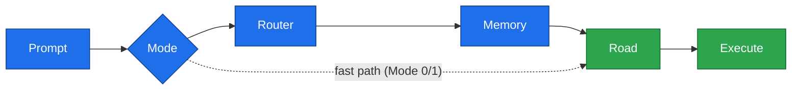

# AKRS v1 — Adaptive Knowledge Routing System

> Deliver the smallest correct knowledge, to the correct agent, at the correct moment.

---

## What is AKRS?

AKRS is a **framework for building AI execution workflows**.

It's not a memory system. It's not a documentation tool. It's not a planning framework.

AKRS is a **knowledge-routing architecture** built on one idea:

> An AI agent is only as good as what you put in front of it. Feed it the whole project and it drowns in noise; feed it the *smallest correct slice* and the right move becomes obvious.

It's a different way to feed a model. Before the agent reasons, AKRS strips out the noise and narrows the design choices down to the one path that actually fits — so the model spends its effort *solving the problem* instead of *guessing where to look and which of a dozen approaches you meant*.

This is **not** just about saving money on a cheaper model (though it does that too). Even your strongest model writes tighter, more in-scope code when it isn't wading through thousands of irrelevant files and a pile of plausible-but-wrong directions. AKRS gives *any* model a clean, narrow, correct field of view — that's the real win.

---

## The Problem It Solves

Large projects create three challenges for AI agents:

- **Too much context** — Agent must scan thousands of files
- **Too many possible files** — Agent doesn't know what to read
- **Too many possible solutions** — Agent has no clear execution path

Large, expensive models survive this through brute force. Small models fail.

AKRS doesn't make agents smarter. **It makes decision spaces smaller.**

---

## The Philosophy Behind AKRS

Imagine you land in London and need to find your friend's house.

**The way we usually do it:** you stop a random stranger and ask, *"Hey, where's my friend's house?"* The stranger has never met you, doesn't know your friend, and has no idea where you started from — so of course you get a shrug, or worse, a confident wrong turn.

That is almost exactly how we talk to an AI. We drop a whole problem on it and just *describe what we want* — with none of the context that would let it actually know where to go — and then we're surprised when it wanders, guesses, or builds the wrong thing.

**A better way** is to narrow the question down, one step at a time:
1. First the **city** — which district am I even in?
2. Then the **neighborhood** — which streets, which landmarks?
3. Then the **exact directions** to the door.

Each question is smaller and more specific than the last, so each answer gets sharper. By the final step there's really only one place left to go.

**AKRS works the same way:**
- **Router** knows the city (which Plan?)
- **Memory** knows the neighborhood (which Knowledge?)
- **Road** knows the street (which files?)
- **Worker** executes with perfect clarity

---

## How It Works

Every execution follows **one path** — each step narrows the decision space
before the AI reasons:



> Full diagrams (modes, lifecycle, close-out) are in
> [`docs/guides/ROUTING-FLOW.md`](docs/guides/ROUTING-FLOW.md).

Each layer answers exactly one question:

| Layer | Answers |
|-------|---------|
| **Router** | Where should execution go? |
| **Memory** | Which knowledge do I need? |
| **Road** | Exactly what should I read? |
| **Task** | Exactly what should I build? |

Nothing is duplicated. Nothing is guessed. Everything is prepared.

### Not every prompt walks the full path

AKRS isn't a cage. The very first thing it does is pick a **Mode** that matches
what you actually asked — and most prompts never touch the full chain:

| Mode | When you'd use it | What runs |
|------|-------------------|-----------|
| **Mode 0** | You already know the exact file/area | Memory + the named files only — no routing |
| **Mode 1** | A small, isolated change | A single Road, fast path |
| **Mode 2** | A Task + Road already exist | Just execute the existing Road |
| **Mode 3** | New work that needs thinking | The Leader **plans**: one Task + one Road |
| **Mode 4** | Architecture / cross-cutting change | Leader only |

So a quick question, a one-file tweak, a "just try this and see," or a prompt
that has nothing to do with writing code at all — planning, exploring, asking
*"what would break if…"* — doesn't get dragged through the whole machine. You
pay for the full funnel only when the work is big enough to deserve it, and you
can always step outside the system entirely when you just want to talk to the
model directly.

> Full mode diagrams are in
> [`docs/guides/ROUTING-FLOW.md`](docs/guides/ROUTING-FLOW.md).

---

## Core Principles

- Knowledge has **exactly one owner**. Everything else references it.
- Knowledge is **never duplicated** across files.
- Knowledge is **only loaded when required**.
- Every file answers **one purpose**. If it solves two, split it.
- **Planning and execution** are different jobs. They never share the same path.

---

## Installation

The fastest way to use AKRS is to copy the framework into your project with a
single command — no permanent dependency, nothing buried in `node_modules`:

```bash
npx akrs-framework init
```

This drops the framework into **`docs/akrs/`** in your current project:

```
docs/akrs/
├── GETTING_STARTED.md   ← the human on-ramp
├── framework/           ← the doctrine the Leader reads (01..11)
└── guides/              ← routing flow + file structure (diagrams)
```

That's all most people need — the files now live in your repo, ready to read and
to hand to your Leader model. Re-run with `npx akrs-framework init --force` to refresh them.

<details>
<summary>Prefer a managed dependency, or just want to read the docs?</summary>

```bash
# Add as a dependency (installs into node_modules):
npm install akrs-framework      # or: pnpm add / yarn add akrs-framework

# Or simply clone the repo and read docs/ directly:
git clone https://github.com/asadeisa/akrs
```
</details>

---

## Quick Start (2 Minutes)

1. Run `npx akrs-framework init` in your project
2. Read `docs/akrs/GETTING_STARTED.md`
3. Generate your first workflow with your Leader model
4. Start your first task

---

## Validate Your Workflow

Once you have a generated `akrs/` workflow, keep it honest with the built-in linter:

```bash
npx akrs-framework validate          # 14 mechanical checks; exits non-zero on any failure
npx akrs-framework validate --fix    # also sync mirrored Road statuses to canonical
npx akrs-framework validate --clean  # also delete stale ephemeral artifacts
```

It checks Road status / expected files / dependency gating, `STATE.md`, the kernel folder,
and the ephemeral-artifact lifecycle (handoff / change / BLOCKED / tester memory). Run it at
every close-out and in CI — **CI green = workflow valid.** Zero dependencies.

---

## Documentation

| Document | Purpose |
|----------|---------|
| [GETTING_STARTED.md](GETTING_STARTED.md) | Complete beginner guide (step-by-step) |
| [docs/guides/ROUTING-FLOW.md](docs/guides/ROUTING-FLOW.md) | Visual explanation of the execution path |
| [docs/guides/FILE-STRUCTURE.md](docs/guides/FILE-STRUCTURE.md) | Folder organization and file ownership |
| [docs/guides/TEAM-ADOPTION.md](docs/guides/TEAM-ADOPTION.md) | Mapping AKRS onto tickets, PRs, CI, and parallel work |
| [docs/framework/](docs/framework/) | Complete framework specifications |
| [examples/](examples/) | Real project examples |
| [docs/validation/](docs/validation/) | Test results and case studies |

---

## Examples

The most complete worked example today is the **Atlas ERP case study** — a full
Phase A → Phase B → execute → close-out cycle:
[`docs/validation/case-study-atlas-erp.md`](docs/validation/case-study-atlas-erp.md).

More sample projects (basic, existing-project integration, v0→v1 migration, full
workflow) are tracked in [`examples/`](examples/) and on the
[roadmap](ROADMAP.md).

---

## Validation & Testing

AKRS v1 has been tested with multiple AI models:

| Model | Test | Result |
|-------|------|--------|
| **Claude (Sonnet)** | Framework generation (Phase A + Phase B) | ✅ Validated |
| **Gemini Flash** | Execution + close-out (drift prevention) | ✅ Validated |
| **DeepSeek** | Generation with requirement changes | ✅ Validated |

See `docs/validation/` for detailed test results and case studies.

**Key finding:** Less-capable models execute reliably when given a well-structured workflow — in the Atlas ERP run, the execution + close-out cost **$0.688 in tokens**, with no loss in quality or scope discipline.

---

## Versioning

- **Framework Version:** v1.2.0 (specifications)
- **Generated Workflows:** Versioned independently (v1, v2, etc.)
- **Kernel Version:** Generated per-project from latest framework (now a `kernel/` folder)

See `VERSIONING.md` for details.

---

## Contributing

AKRS is an open-source project. Contributions are welcome.

See `CONTRIBUTING.md` for guidelines:
- Reporting issues
- Submitting pull requests
- Documentation standards
- Release philosophy

---

## License

MIT License — see `LICENSE` for details.

AKRS is free to use, modify, and distribute in personal and commercial projects.

---

## Support

**Questions?**
- Start with `GETTING_STARTED.md`
- Check `docs/framework/` for specifications
- Review `examples/` for real projects
- Read `docs/validation/` for test results

**Found a bug?**
- Report it on GitHub

**Want to contribute?**
- See `CONTRIBUTING.md`

---

## What's Next?

👉 **New to AKRS?** Start with [`GETTING_STARTED.md`](GETTING_STARTED.md)

👉 **Want to understand the architecture?** Read [`docs/guides/ROUTING-FLOW.md`](docs/guides/ROUTING-FLOW.md)

👉 **Ready to build?** See the [case study](docs/validation/case-study-atlas-erp.md) and [`examples/`](examples/)

👉 **Looking for specifications?** See [`docs/framework/`](docs/framework/)

---

Made with care for developers who want reliable, predictable AI agents.

**AKRS v1.2.0** — July 2026
