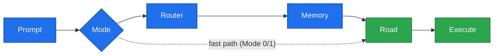

# AKRS — Adaptive Knowledge Routing System



> Deliver the smallest correct knowledge, to the correct agent, at the correct moment.

---

## What it is

Point an agent at a small project and it just works.

Point it at a real codebase and you watch it open eleven files to find the three
that mattered, reach for an approach you rejected two weeks ago, edit something
outside the ticket, and leave your docs describing code that no longer exists.
Every one of those files is still sitting in the context window when it finally
starts writing.

AKRS moves the thinking out of the prompt and into the repo.

Your strongest model reads the specification once and compiles a routing layer
into `akrs/`: a one-page Kernel, a Router, a Memory index, and one Road per task
naming exactly what to read, what to change, and where to stop. Every agent
after that boots from the routing layer instead of from your codebase — and
opens a **window** into each file it needs, never the whole file.

AKRS is not a memory system, not a documentation tool, not a planning tool, not
an MCP server, and not a runtime.

**AKRS is a knowledge-routing doctrine.** A doctrine is a specification your
strong model reads once and compiles into a project-specific routing layer, so
every later agent — on any model — is handed the smallest correct slice of your
project at the moment it acts, instead of being told to go find it.

There is no app to install: the specification is the product. `npx
akrs-framework init` drops eleven markdown files into your repo, and `validate`
is a zero-dependency linter that proves the workflow still agrees with the code.
Nothing runs at inference time — which is why it works with **any agent that
boots from `AGENTS.md`**: Codex, Claude Code, Gemini CLI, Cursor, Copilot, or
whatever ships next.

---

## The Problem It Solves

Large projects create three challenges for AI agents:

- **Too much context** — Agent must scan thousands of files
- **Too many possible files** — Agent doesn't know what to read
- **Too many possible solutions** — Agent has no clear execution path

Large, expensive models survive this through brute force. Small models fail.

The objective is **not** reducing tokens. The objective is reducing the agent's
**decision space** before reasoning begins — the smaller the decision space, the
more predictable and reliable even a small execution model becomes.

AKRS doesn't make agents smarter. **It makes decision spaces smaller.**

---

## The Philosophy Behind AKRS

Imagine you land in London and need to find your friend's house.

**The way we usually do it:** you stop a random stranger and ask, *"Hey, where's my friend's house?"* The stranger has never met you, doesn't know your friend, and has no idea where you started from — so of course you get a shrug, or worse, a confident wrong turn.

That is almost exactly how we talk to an AI. We drop a whole problem on it and just *describe what we want* — with none of the context that would let it actually know where to go — and then we're surprised when it wanders, guesses, or builds the wrong thing.

**A better way** is to narrow the question down, one step at a time:
1. First the **city** — which district am I even in?
2. Then the **neighborhood** — which streets, which landmarks?
3. Then the **exact directions** to the door.

Each question is smaller and more specific than the last, so each answer gets sharper. By the final step there's really only one place left to go.

**AKRS works the same way:**
- **Router** knows the city (which Plan?)
- **Memory** knows the neighborhood (which Knowledge?)
- **Road** knows the street (which files?)
- **Worker** executes with perfect clarity

---

## How It Works

Every execution follows **one path** — each step narrows the decision space
before the AI reasons:


```mermaid
flowchart LR
    P[Prompt] --> M{Mode}
    M --> R[Router]
    R --> Mem[Memory]
    Mem --> Road[Road]
    Road --> E[Execute]
    M -. "fast path (Mode 0/1)" .-> Road

    classDef plan fill:#1f6feb,stroke:#0b3d91,color:#fff;
    classDef exec fill:#2da44e,stroke:#116329,color:#fff;
    class P,M,R,Mem plan;
    class Road,E exec;
```

> Full diagrams (modes, lifecycle, close-out) are in
> [`docs/guides/ROUTING-FLOW.md`](docs/guides/ROUTING-FLOW.md).

Each layer answers exactly one question:

| Layer | Answers |
|-------|---------|
| **Router** | Where should execution go? |
| **Memory** | Which knowledge do I need? |
| **Road** | Exactly what should I read? |
| **Task** | Exactly what should I build? |

Nothing is duplicated. Nothing is guessed. Everything is prepared.

### Not every prompt walks the full path

AKRS isn't a cage. The very first thing it does is pick a **Mode** that matches
what you actually asked — and most prompts never touch the full chain:

| Mode | When you'd use it | What runs |
|------|-------------------|-----------|
| **Mode 0** | You already know the exact file/area | Memory + the named files only — no routing |
| **Mode 1** | A small, isolated change | A single Road, fast path |
| **Mode 2** | A Task + Road already exist | Just execute the existing Road |
| **Mode 3** | New work that needs thinking | The Leader **plans**: one Task + one Road |
| **Mode 4** | Architecture / cross-cutting change | Leader only |

So a quick question, a one-file tweak, a "just try this and see," or a prompt
that has nothing to do with writing code at all — planning, exploring, asking
*"what would break if…"* — doesn't get dragged through the whole machine. You
pay for the full funnel only when the work is big enough to deserve it, and you
can always step outside the system entirely when you just want to talk to the
model directly.

> Full mode diagrams are in
> [`docs/guides/ROUTING-FLOW.md`](docs/guides/ROUTING-FLOW.md).

---

## Works With Any Agent

AKRS standardizes on **`AGENTS.md`** as the single canonical entry file. Every
other tool gets a thin pointer that just refers back to it — so the same
workflow behaves identically no matter which CLI you run it in, and a plan
started in one tool resumes in another from `STATE.md`.

| Tool | Entry file | How it points |
|---|---|---|
| Codex CLI | `AGENTS.md` | native — *is* the canonical file |
| Claude Code / CLI | `CLAUDE.md` | `@AGENTS.md` import |
| Gemini CLI | `GEMINI.md` | "Read AGENTS.md and follow it." |
| Cursor | `.cursor/rules` | "Read AGENTS.md and follow it." |
| GitHub Copilot | `.github/copilot-instructions.md` | "Read AGENTS.md and follow it." |

Adding a new tool means adding a pointer file — never touching the workflow.
Specification: [`05-Platform-Adapter-Specification.md`](docs/framework/05-Platform-Adapter-Specification.md).

---

## Core Principles

- Knowledge has **exactly one owner**. Everything else references it.
- Knowledge is **never duplicated** across files.
- Knowledge is **only loaded when required**.
- Every file answers **one purpose**. If it solves two, split it.
- **Planning and execution** are different jobs. They never share the same path.

---

## Installation

The fastest way to use AKRS is to copy the framework into your project with a
single command — no permanent dependency, nothing buried in `node_modules`:

```bash
npx akrs-framework init
```

This drops the framework into **`docs/akrs/`** in your current project:

```
docs/akrs/
├── GETTING_STARTED.md   ← the human on-ramp
└── framework/           ← the doctrine the Leader reads (01..11 + skills/)
```

That's all most people need — the files now live in your repo, ready to read and
to hand to your Leader model. Re-run with `npx akrs-framework init --force` to refresh them.
The human guides live on GitHub (linked below); the README's links to them keep working on npm.

<details>
<summary>Prefer a managed dependency, or just want to read the docs?</summary>

```bash
# Add as a dependency — a postinstall hook auto-syncs the framework
# out of node_modules into your project's docs/akrs/:
npm install akrs-framework      # or: pnpm add / yarn add akrs-framework

# Or simply clone the repo and read docs/ directly:
git clone https://github.com/asadeisa/akrs
```

Since v1.3.1, installing the package as a dependency runs the same copy `init` does — the
framework doctrine lands in `docs/akrs/framework/` so your workflow reads local files, never
`node_modules`. (Set `AKRS_SKIP_POSTINSTALL=1` to opt out.)
</details>

---

## Quick Start (2 Minutes)

1. Run `npx akrs-framework init` in your project
2. Read `docs/akrs/GETTING_STARTED.md`
3. Generate your first workflow with your Leader model
4. Start your first task

---

## Validate Your Workflow

Once you have a generated `akrs/` workflow, keep it honest with the built-in linter:

```bash
npx akrs-framework validate          # 17 mechanical checks; exits non-zero on any failure
npx akrs-framework validate --fix    # also sync mirrored Road statuses + rotate an over-size LOG ledger
npx akrs-framework validate --clean  # also delete stale ephemeral artifacts
```

Generated projects also ship a `package.json` that wires this up, so a developer who has never
seen the `npx` commands can just run **`npm run validate`** (or `validate:fix` / `validate:clean`).

It checks Road status / expected files / dependency gating, `STATE.md` (including parked owner
decisions), the `LOG.md` ledger (entry length + rotation), the kernel folder, and the
ephemeral-artifact lifecycle (handoff / change / BLOCKED / tester memory). Run it at every
close-out and in CI — **CI green = workflow valid.** Zero dependencies.

---

## Documentation

| Document | Purpose |
|----------|---------|
| [GETTING_STARTED.md](GETTING_STARTED.md) | Complete beginner guide (step-by-step) |
| [docs/guides/ROUTING-FLOW.md](docs/guides/ROUTING-FLOW.md) | Visual explanation of the execution path · *read online (GitHub) — not copied by `init`* |
| [docs/guides/FILE-STRUCTURE.md](docs/guides/FILE-STRUCTURE.md) | Folder organization and file ownership · *read online (GitHub)* |
| [docs/guides/TEAM-ADOPTION.md](docs/guides/TEAM-ADOPTION.md) | Mapping AKRS onto tickets, PRs, CI, and parallel work · *read online (GitHub)* |
| [docs/framework/](docs/framework/) | Complete framework specifications (incl. `skills/`) |
| [examples/](examples/) | Real project examples |
| [docs/validation/](docs/validation/) | Test results and case studies |

---

## Examples

The most complete worked example today is the **Atlas ERP case study** — a full
Phase A → Phase B → execute → close-out cycle:
[`docs/validation/case-study-atlas-erp.md`](docs/validation/case-study-atlas-erp.md).

More sample projects (basic, existing-project integration, v0→v1 migration, full
workflow) are tracked in [`examples/`](examples/) and on the
[roadmap](ROADMAP.md).

---

## Validation & Testing

AKRS v1 has been tested with multiple AI models:

| Model | Test | Result |
|-------|------|--------|
| **Claude (Sonnet)** | Framework generation (Phase A + Phase B) | ✅ Validated |
| **Gemini Flash** | Execution + close-out (drift prevention) | ✅ Validated |
| **DeepSeek** | Generation with requirement changes | ✅ Validated |

See `docs/validation/` for detailed test results and case studies.

**Key finding:** a less-capable model, given a one-line prompt and a
well-structured workflow, executed a real backend task, stayed inside scope, and
reconciled the workflow afterward — without ever asking what to read.

> **On cost.** AKRS deliberately does not record its own token or cost
> telemetry: an executing agent cannot know those numbers reliably, and asking
> for them only invites fabrication. Cost belongs to your provider's usage
> dashboard, correlated with the `LOG.md` ledger's Road-by-Road chronology.
> Model prices also fall every few months — the argument here is about decision
> space, which doesn't.

---

## Versioning

- **Framework Version:** v1.3.1 (specifications)
- **Generated Workflows:** Versioned independently (v1, v2, etc.)
- **Kernel Version:** Generated per-project from latest framework (now a `kernel/` folder)

See `VERSIONING.md` for details.

---

## Contributing

AKRS is an open-source project. Contributions are welcome.

See `CONTRIBUTING.md` for guidelines:
- Reporting issues
- Submitting pull requests
- Documentation standards
- Release philosophy

---

## License

MIT License — see `LICENSE` for details.

AKRS is free to use, modify, and distribute in personal and commercial projects.

---

## Support

**Questions?**
- Start with `GETTING_STARTED.md`
- Check `docs/framework/` for specifications
- Review `examples/` for real projects
- Read `docs/validation/` for test results

**Found a bug?**
- Report it on GitHub, or email [asad.eisa.dev@gmail.com](mailto:asad.eisa.dev@gmail.com)

**Want to contribute?**
- See `CONTRIBUTING.md`

---

## What's Next?

👉 **New to AKRS?** Start with [`GETTING_STARTED.md`](GETTING_STARTED.md)

👉 **Want to understand the architecture?** Read [`docs/guides/ROUTING-FLOW.md`](docs/guides/ROUTING-FLOW.md)

👉 **Ready to build?** See the [case study](docs/validation/case-study-atlas-erp.md) and [`examples/`](examples/)

👉 **Looking for specifications?** See [`docs/framework/`](docs/framework/)

---

Made with care for developers who want reliable, predictable AI agents.

**AKRS v1.3.1** — August 2026
