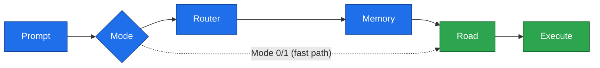
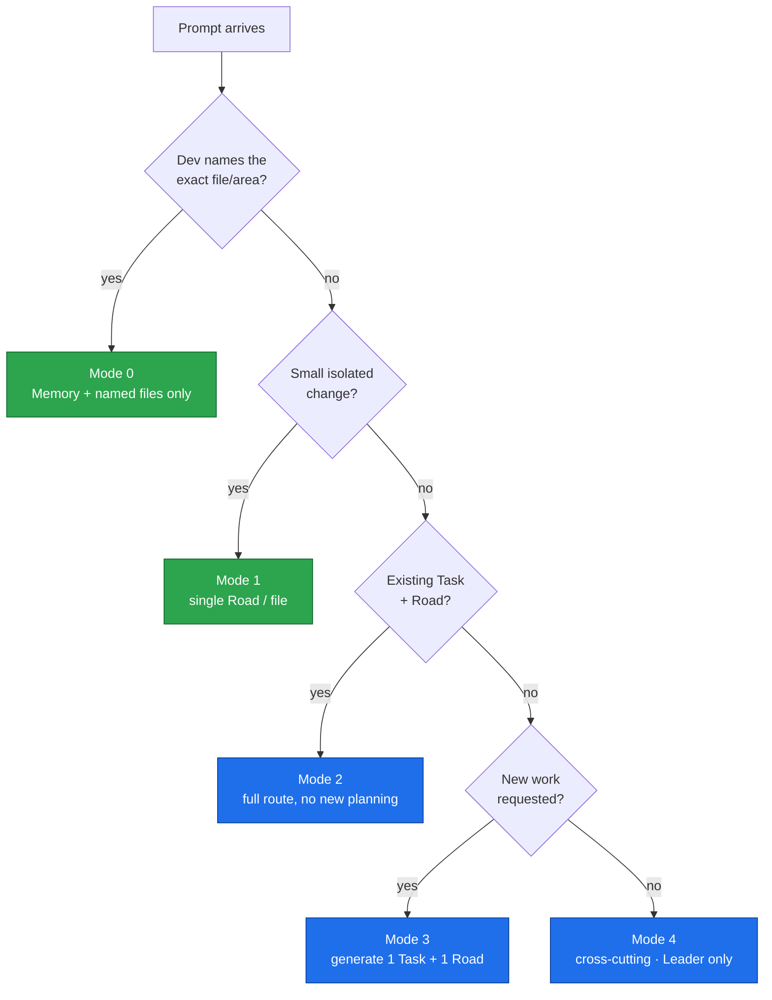
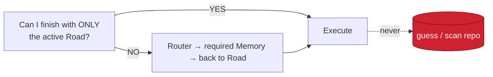
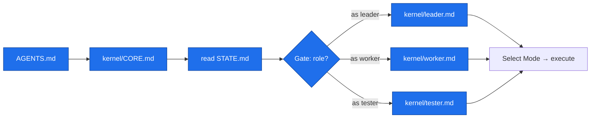
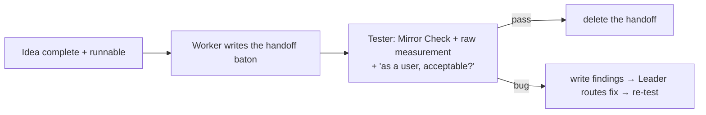
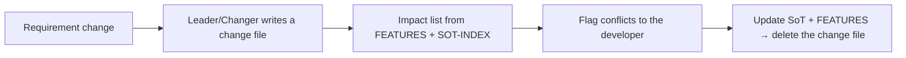
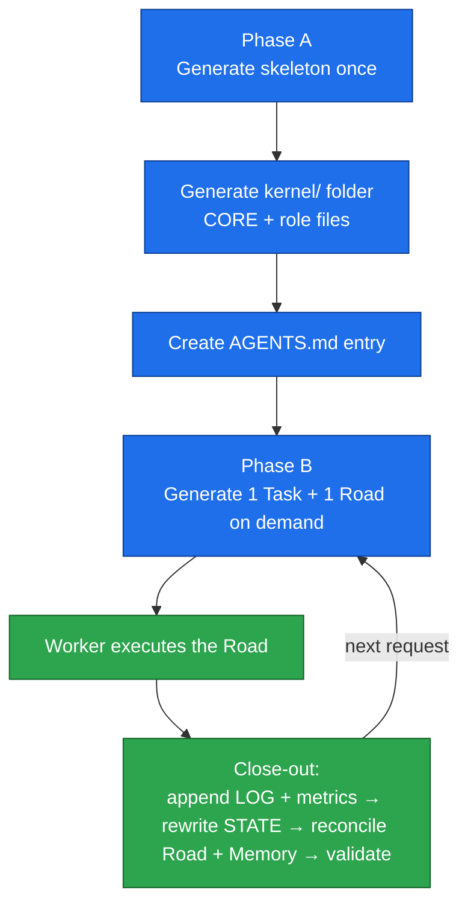

# Routing Flow

> How a single prompt becomes one obvious execution path.

AKRS funnels every request through a fixed sequence. Each step narrows the
decision space, the same way you narrow a search for a house in a city you
don't know: **city → neighborhood → street → door.**

---

## The One Route



Each layer answers exactly **one** question, and owns nothing else:

| Layer | The one question it answers | London analogy |
|-------|-----------------------------|----------------|
| **Prompt** | What does the developer want? | "I need my friend's house" |
| **Mode** | How much navigation is needed? | Tourist vs. local |
| **Router** | Where should execution go? | Which part of the city |
| **Memory** | Which knowledge is required? | Which neighborhood |
| **Road** | Exactly what to read and change? | The exact street + door |
| **Execute** | Build it. | Knock on the door |

---

## Modes (the funnel's first decision)

Before routing, the system picks a **Mode** from the prompt. The Mode decides
how much of the chain you actually walk.



- **Modes 0–1 are the fast path** — trivial/isolated work skips the full chain.
  Mode 0 is the escape hatch: name the sources, read no workflow.
- **Mode 2** executes an existing Road.
- **Mode 3** is planning: the Leader generates one Task + one Road — or **batches** a plan's
  Roads at once, the first `ACTIVE` and the rest `QUEUED` (each re-validated before it
  activates). Road status is `QUEUED → ACTIVE → DONE + superseded`.
- **Mode 4** is architecture / **change management**: Leader only (the change lane above).

---

## The Blind-Assumption Check

The Worker asks itself **once**, before writing anything:



Asked **once**. No recursive routing. No repo scanning. **Never guess.**
A missing piece of required knowledge is a *routing* failure to be fixed in the
Road — not something the Worker should improvise around.

---

## Runtime Priority

During execution, the order of authority is always:

```
Road  →  Memory  →  Router  →  Repository
```

The repository is consulted **only** when the active Road explicitly says so.
This is what stops a cheap model from drowning in a large codebase.

---

## The Gate (v1.2 — every session is filtered)

Boot no longer loads one big Kernel. The **Gate** loads the shared `CORE.md` plus **exactly
one role file**, so a session carries only its own role's rules:



Role comes from the prompt convention (`as leader|worker|tester:`), else STATE's `Role:`, else
the session asks. A stuck non-leader agent drops an `akrs/BLOCKED.md` flag, which the next
session surfaces first.

## The Tester lane (v1.2 — Done is proven, not asserted)

Verification attaches to the **idea/Plan**, not every Task. The Worker leaves a **handoff**
baton; the Tester verifies the running product and deletes it on pass:



## The change lane (v1.2 — Mode 4, features change safely)



## The Lifecycle (zoomed out)

Routing happens inside a larger loop. Plan rarely; execute often; reconcile
always.



- **Blue = Leader** (think once): expensive model, infrequent.
- **Green = Worker** (execute many): cheap model, constant.

---

## Why This Works

A large project gives an AI **too much context, too many files, too many
solutions**. Big models survive it by brute force; small models fail.

AKRS removes the wrong options *before* reasoning begins. By the time the Worker
acts, "many possible answers" has become "one obvious execution path" — which is
exactly the regime in which inexpensive models become reliable.

See [`FILE-STRUCTURE.md`](FILE-STRUCTURE.md) for what each file contains, and
[`../framework/01-Constitution.md`](../framework/01-Constitution.md) for the
full doctrine.
